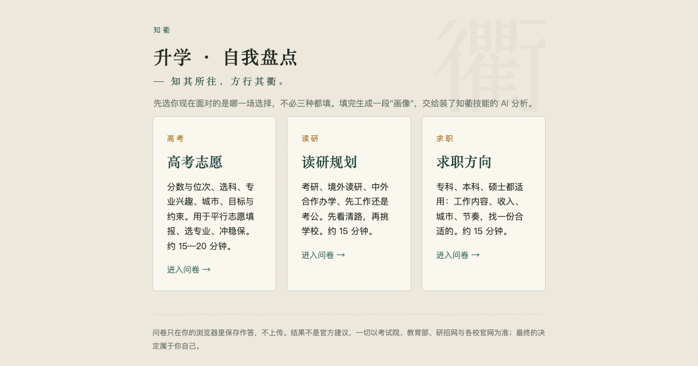
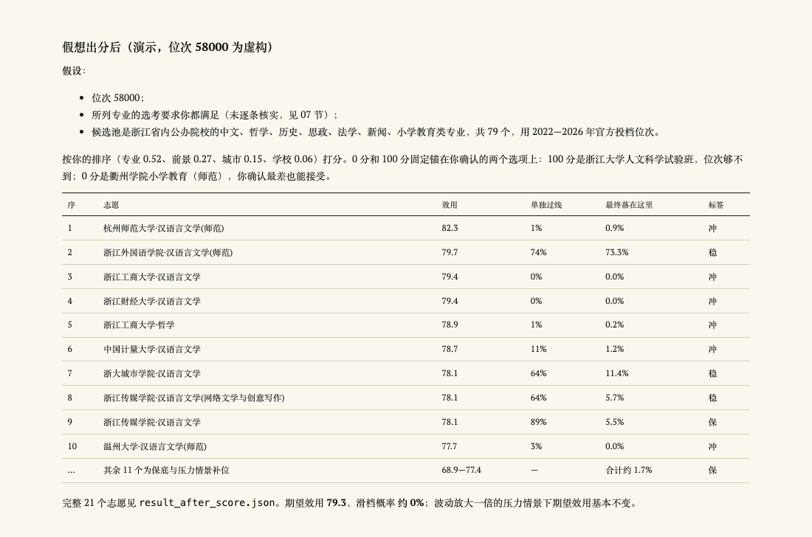
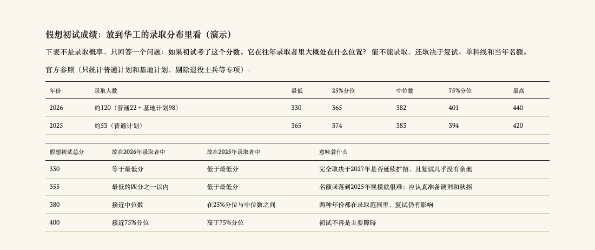
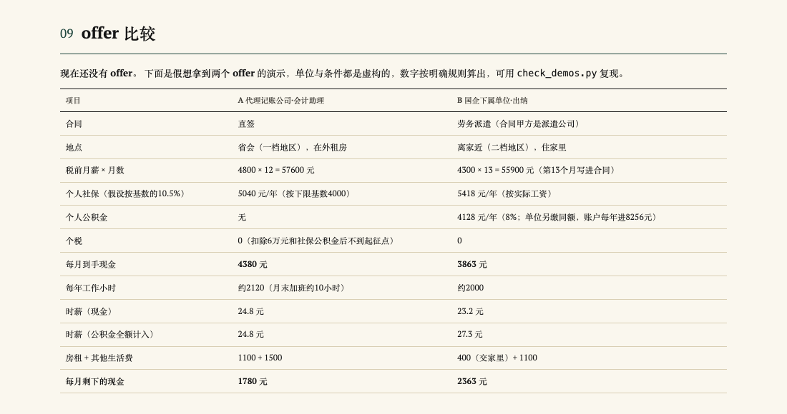

<p align="center"></p>

<h1 align="center">知衢 Zhiqu</h1>

<p align="center"><b>面向高考、读研与求职的发展规划技能</b><br>知其所往，方行其衢。</p>

<p align="center">
  <a href="https://wjsgzz.github.io/Zhiqu/"></a>
  
  
  
  <a href="LICENSE"></a>
</p>

<p align="center"></p>

知衢是一组安装在 AI Agent 上的技能。用户先填一份约 15 分钟的问卷，Agent 读取问卷生成的画像，调用官方公开数据完成计算，交付一份固定 12 节的决策报告，内容包括可选方案、录取概率或分数情景、代价、下一步和重新评估的时间点。

## 功能

| 场景 | 回答的问题 | 核心产出 |
|---|---|---|
| **高考** | 志愿怎么填 | 按各省官方投档位次预测录取线，计算每个志愿的录取概率与滑档风险，优化整张志愿表并生成填报单 |
| **读研** | 考研、境外读研、中外合作办学、先工作还是考公 | 路径比较；把可能的初试分数放进目标院校往年录取分布对照；时间线与检查点 |
| **求职** | 找什么工作，选哪个 offer | 按兴趣、能力与收入底线生成职业方向；测算到手收入、时薪与扣除房租后的月结余；合同与权益风险 |
| **八字**（可选） | 传统视角的自我对照 | 问卷内排盘；与性格自评、现实条件三方对照，不参与打分与排序 |

**原则**
- 只用官方公开数据，标明年份与来源。
- 高考概率在有位次数据的省份经留出年份检验；读研和求职没有依据时只做情景比较，不编百分比。
- 给路线图，不代写文书、不改简历、不代为填报。
- 按阶段更新：出分、拿到 offer 等节点重新计算。

## 示例

三位模拟用户，2027 年各自站在一个路口：一个要高考，一个要考研，一个要找第一份工作。他们来自浙江、广东、四川，家境普通，没有竞赛奖，也没有内部消息。知衢先听他们说清自己，再用 2026 年及以前的官方数据算给他们看。

### 小禾 · 17 岁 · 浙江高三

> 喜欢哲学和历史，但大家都说不好就业，该不该坚持？师范是适合我，还是只是父母觉得稳？

选考历史、政治、地理，作文好，数学不稳。家里每年能拿出 2.6 万，父母希望她读师范、将来当老师；她不排斥，只是不想只因为"稳定"。

- **出分前**：不急着填表。先把"喜欢哲学"拆成看得见的日常：读两份培养方案，做一次课程体验，再决定它是专业、辅修还是爱好。
- **模拟出分（位次 58000）**：用浙江 2022—2026 年投档位次预测 2027 年的录取线，排出 21 个志愿。最可能录取的是浙江外国语学院汉语言文学（师范），约 73%，滑档风险接近 0。
- **和父母的分歧**：换成父母"前景优先"的排序重算，最可能的去向不变。分歧只牵动约四分之一的结果，比一家人吵起来时想的小得多。
- **钱**：按浙外 2026 年的收费标准，每年约 2.2 万，预算内还剩 4000。



[完整报告](skills/zhiqu/examples/demo_2027_gaokao/report.md) · [PDF](skills/zhiqu/examples/demo_2027_gaokao/report.pdf) · [画像](skills/zhiqu/examples/demo_2027_gaokao/profile.txt)

### 小林 · 21 岁 · 广东电气大四

> 我是不是只是因为怕就业才考研？既要准备考试又要秋招，怎样才不两头落空？

均分 80，六级没过，数学模拟卷常做不完。她喜欢调设备、解决具体问题，想往电机控制或电力系统走。心里向往华南理工大学，又怕够不着。

- **路径**：主线考电气，同时投少量相关秋招。保险路径也要真的落实，不能只写在纸上。
- **华工的数据里有个容易忽略的变化**：电气专硕 2026 年统考录取约 120 人，是 2025 年的两倍多，新增的主要是"基地计划"。两年录取者的初试中位数都在 382 分左右，变的是最低分，从 365 降到 330。2027 年基地计划是否延续，决定了 330—365 分这一段有没有机会。
- **模拟初试成绩**：330、355、380、400 四个分数各放进两年的录取分布里看位置。不编个人录取概率。
- **钱**：华工 2026 年电气专硕学费 8000 元一年，加住宿和生活，三年约 7.6 万，在家里预算内。



[完整报告](skills/zhiqu-grad/examples/demo_2027/report.md) · [PDF](skills/zhiqu-grad/examples/demo_2027/report.pdf) · [画像](skills/zhiqu-grad/examples/demo_2027/profile.txt)

### 小宁 · 20 岁 · 四川高职会计

> 如果先去小公司做财务，是不是就比升本差？"国企"两个字到底意味着什么？

细致、慢热，喜欢把账对上，不想做推销。家里支持有限，毕业三个月内就得有收入；父母希望他考编或进国企。

- **方向**：会计助理、出纳、应收应付文员。四川官方工资价位里，会计专业人员年薪中位数约 6.8 万。这是在岗人员的水平，不是应届起薪。
- **专升本**：留作有条件的选项。先算清家里能不能承担两年没有全职工资。
- **模拟两个 offer**：省会的直签岗位税前更高，但要租房，每月只剩约 1700 元。离家近的国企派遣岗位工资更低，社保还得按 2026 年 4699 元的基数下限缴，但住在家里，每月能剩约 2320 元，另有公积金。**钱多不等于剩得多**；而"国企"岗位的合同其实签在派遣公司，要先问清能不能转直签。



[完整报告](skills/zhiqu-career/examples/demo_2027/report.md) · [PDF](skills/zhiqu-career/examples/demo_2027/report.pdf) · [画像](skills/zhiqu-career/examples/demo_2027/profile.txt)

## 快速开始

### 1. 安装

需要 Python 3.10 或更高版本；生成 PDF 需要本机安装 Chrome、Edge 或 Chromium（没有时输出 HTML）。脚本只用 Python 标准库，无需 `pip install`。

```bash
git clone --depth 1 https://github.com/WJSGZZ/Zhiqu.git
cd Zhiqu

DEST=~/.claude/skills        # Codex 使用 ~/.codex/skills
mkdir -p "$DEST"
for s in zhiqu zhiqu-grad zhiqu-career bazi; do
  if [ -e "$DEST/$s" ]; then echo "已存在 $DEST/$s，未覆盖"; else cp -R "skills/$s" "$DEST/$s"; fi
done
```

四个技能必须安装在同一目录下，它们通过相对路径共用规则与数据。常用的技能目录：

| Agent | 个人安装 | 项目内安装 |
|---|---|---|
| Claude Code | `~/.claude/skills/` | `<项目>/.claude/skills/` |
| Codex | `~/.codex/skills/` | 按 Codex 文档 |
| 其他支持 `SKILL.md` 的 Agent | 按其文档 | 按其文档 |

验证安装：

```bash
cd "$DEST/zhiqu"
python3 scripts/optimize.py examples/candidates_demo.csv --rank 30000 --slots 12 --u-fall -60
```

输出一张探索用志愿表后，再运行 `python3 scripts/check_demos.py`，验证三版示例及八字依赖。`check_family.py` 是仓库级检查，需在含问卷的完整仓库中运行。正式填报须使用已核实资格证据与 `--decision-mode formal --target-year 年份`；示例只演示计算。更新时先 `git pull`，删除旧的四个目录后重新复制。

### 2. 填写问卷

打开[在线问卷](https://wjsgzz.github.io/Zhiqu/)，选择高考、读研或求职。完成后点击"生成我的画像"并复制。画像以 `【高考志愿 · 自我盘点】`、`【读研 · 自我盘点】` 或 `【求职 · 自我盘点】` 开头，Agent 据此选择技能。作答只保存在浏览器本地。

### 3. 生成报告

把画像发给已安装技能的 Agent，并说明当前阶段和想解决的问题：

```text
这是我的知衢画像。我是 2027 年浙江考生，已出分，位次 58000。
请核实当年招生计划与选考要求，先让我确认专业偏好和调剂态度，再计算志愿表。
【高考志愿 · 自我盘点】
……
```

Agent 会追问影响结论的缺项，查询官方数据，输出 HTML 与 PDF 报告。报告第一页是结论和下一步。

## 部署问卷

问卷是静态网页，不需要后端：

- **GitHub Pages**：Fork 本仓库，在 Settings → Pages 中选择 `main` 分支根目录，访问 `https://<用户名>.github.io/Zhiqu/`。
- **本地**：直接用浏览器打开 `index.html`。

八字排盘从 jsDelivr 加载 [lunar-javascript](https://github.com/6tail/lunar-javascript)；无法联网时，问卷其余部分照常使用，出生信息原样写入画像，由 Agent 排盘。

## 工作原理


**高考**：在位次的对数空间预测录取线：以上一年为主、加近年加权，叠加全省漂移；按位次段、历史长度和是否跳变区分波动。用蒙特卡洛模拟共同波动下的录取结果，以贪心加交换的方法选出期望满意度最高、滑档概率受限的组合。满意度由考生自己的优先级排序换算权重，0 分和 100 分锚定在本人确认的两个选项上。各省参数只用本省数据，在留出年份检验。

**读研与求职**：没有统一的全国数据库，确定方向后按候选收集数据。读研以官方拟录取名单的分数分布做情景对照；求职以人社部门工资价位作群体参考，按个税与社保规则测算 offer。

详见[模型说明](skills/zhiqu/references/volunteer-game.md)与[回测记录](skills/zhiqu/references/backtests.md)。

## 数据

- **高考**：广东、浙江、江苏、山东、河北、辽宁、湖南、湖北、上海、黑龙江 10 省的官方投档数据，以及可得的一分一段表，整理为 CSV，各省目录注明来源与口径（[数据说明](skills/zhiqu/data/README.md)、[已知缺口](skills/zhiqu/references/public-data-gaps.md)）。
- **读研、求职**：教育部与研招网规定、院校拟录取名单、人社部门工资价位与最低工资、劳动法规，按需查询并记录来源。
- 验证码、登录和人机验证一律不绕过，记为缺口。会过期的事实标注复核期限。

## 项目结构

```
index.html · gaokao.html · grad.html · career.html   问卷
skills/
├── zhiqu/          高考技能，兼三版共用层：数据、预测、优化、报告、检查脚本
├── zhiqu-grad/     读研技能
├── zhiqu-career/   求职技能
└── bazi/           八字技能：排盘引擎与解盘方法
AGENTS.md           贡献者（含 AI Agent）工作规范
```

## 开发

```bash
python3 -m unittest discover -s skills/zhiqu/tests    # 单元测试
python3 skills/zhiqu/scripts/check_family.py          # 引用、问卷节名、报告结构、复核期限
python3 skills/zhiqu/scripts/check_demos.py           # 复现三个示例的排盘与计算
python3 skills/zhiqu/scripts/validate_data.py         # 数据校验
```

参与开发前请阅读 [AGENTS.md](AGENTS.md)。

## 局限

- 录取概率、分数情景与收入测算都是估计，不保证录取或录用；模拟中未出现滑档不等于没有风险。
- 数据覆盖有限：高考 10 省，部分省份缺位次或历史类数据；读研和求职依赖按需查询。
- 八字的现实预测效度未经验证，仅作可选的自我对照。
- 一切以考试院、教育部、各校与用人单位当年的正式文件为准，最终决定由本人作出。

## 许可证

[MIT](LICENSE) © 2026 Xik Pai。可以自由使用、修改、分发和商用，但须在副本中保留原版权声明与许可文本。

第三方组件保留各自的许可证：[lunar-python](skills/bazi/scripts/vendor/LUNAR_PYTHON_LICENSE.txt)（随仓库分发）与 lunar-javascript（问卷在线加载），均为 MIT。招生、工资、政策等数据来自各级政府与院校的公开资料，本仓库只做整理，原始数据的权利属于发布方。
